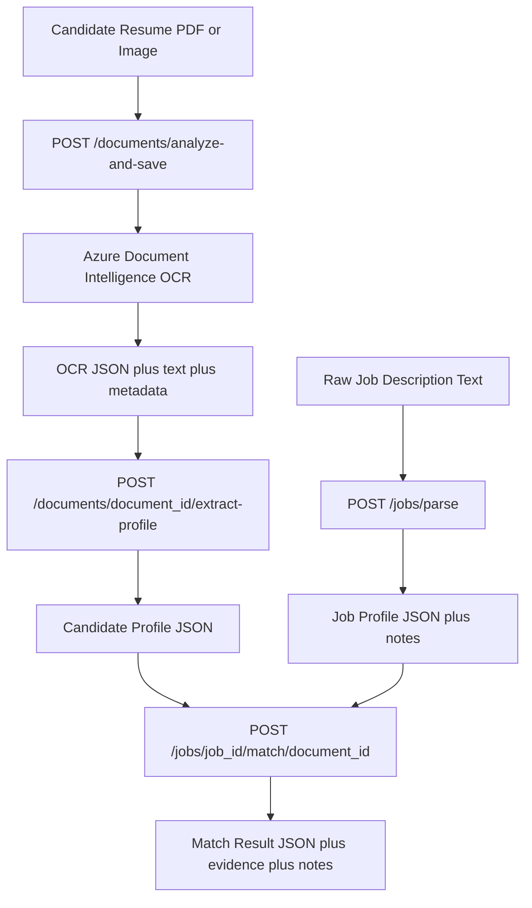

# Azure Job Application Selector

A production-style OCR and document intelligence backend that analyzes candidate application documents, extracts structured profiles, parses job descriptions, and computes explainable candidate-job match results using Azure services and FastAPI.

## Why this project

This project is being built as an 8-week portfolio system focused on recruiter-visible engineering depth in OCR, backend orchestration, structured extraction, reproducible artifacts, and explainable matching workflows. The backend follows a modular FastAPI structure with routers, schemas, and service layers, which aligns with common FastAPI organization patterns for larger applications.

## Current status

The current implementation supports candidate OCR processing, candidate profile extraction, job description parsing, saved-profile matching, service-layer unit tests, route-level tests, schema-backed Swagger examples, parser notes for ambiguous job descriptions, and edge-case matcher validation. The project includes reproducible saved artifacts for OCR outputs, job profiles, and match results, which makes debugging and evaluation easier in document intelligence systems.

## Architecture



The backend is organized so document ingestion, parsing, and matching logic remain separated instead of being coupled inside one script, which makes later extension into evaluation, async processing, and retrieval easier.

## Project structure

```text
.
├── app/
│   ├── main.py
│   ├── api/
│   │   └── routes/
│   │       ├── health.py
│   │       ├── documents.py
│   │       └── jobs.py
│   ├── core/
│   │   ├── config.py
│   │   └── logging.py
│   ├── models/
│   ├── schemas/
│   │   ├── jobs.py
│   │   └── matching.py
│   └── services/
│       ├── blob_service.py
│       ├── candidate_profile_service.py
│       ├── document_intelligence_service.py
│       ├── job_profile_service.py
│       └── matching_service.py
├── data/
│   ├── evaluation/
│   │   ├── candidates/
│   │   ├── jobs/
│   │   └── matching/
│   ├── job_profiles/
│   ├── match_results/
│   ├── ocr_outputs/
│   └── uploads/
├── scripts/
│   └── run_evaluation.py
├── tests/
│   ├── conftest.py
│   ├── test_candidate_profile_service.py
│   ├── test_documents_route.py
│   ├── test_job_profile_service.py
│   └── test_matching_service.py
├── .env.example
├── .gitignore
├── requirements.txt
└── README.md
```

## Features

- Upload candidate documents and process them with Azure Document Intelligence OCR.
- Save OCR artifacts as raw JSON, plain text, and metadata for each document.
- Extract structured candidate profile fields from OCR output using deterministic parsing rules.
- Parse raw job descriptions into title, location, skills, years of experience, and parser notes for ambiguous inputs.
- Match saved candidate profiles against saved job profiles with transparent scoring, evidence snippets, and decision notes.
- Match saved candidate profiles directly against a structured job payload in Swagger UI.
- Validate parser and matcher behavior using Pytest unit tests and edge-case scoring tests.
- Validate document-analysis routes with request-level file upload tests using FastAPI TestClient patterns.
- Provide realistic request examples in generated OpenAPI docs through Pydantic schema metadata.

## Processing flow

```text
Candidate document
  -> /documents/analyze-and-save
  -> OCR outputs saved
  -> /documents/{document_id}/extract-profile
  -> candidate_profile.json saved

Raw job description
  -> /jobs/parse
  -> job_profile.json saved

Saved candidate profile + saved job profile
  -> /jobs/{job_id}/match/{document_id}
  -> match_result.json saved

Saved candidate profile + structured job payload
  -> /documents/{document_id}/match
  -> direct match response in Swagger/UI
```

## API endpoints

| Endpoint | Method | Purpose |
|---|---|---|
| `/health` | GET | Basic service health check. |
| `/documents/ping` | GET | Verify the documents router is mounted. |
| `/documents/analyze` | POST | Run OCR on an uploaded file and preview extracted text. |
| `/documents/analyze-and-save` | POST | Run OCR on an uploaded file and save OCR outputs. |
| `/documents/{document_id}/extract-profile` | POST | Extract and save a candidate profile from OCR text. |
| `/jobs/parse` | POST | Parse raw job description text and save a job profile with notes. |
| `/jobs/{job_id}/match/{document_id}` | POST | Match a saved candidate profile to a saved job profile and save the result. |
| `/documents/{document_id}/match` | POST | Match a saved candidate profile to a structured job payload directly in the docs UI. |

## Tech stack

| Layer | Tools |
|---|---|
| API backend | FastAPI, Python |
| OCR | Azure Document Intelligence |
| Storage | Azure Blob Storage, local artifact folders |
| Parsing | Python regex and rule-based extraction |
| Testing | Pytest, FastAPI TestClient |
| Matching | Deterministic skill-based scoring, evidence snippets, and explainable notes |

## Week 1: Core Pipeline — COMPLETE

Completed deliverables:

Backend services:
- `app/services/candidate_profile_service.py` — OCR to name, email, phone, LinkedIn, GitHub, and skills.
- `app/services/job_profile_service.py` — job text to title, location, years of experience, and required/preferred skills.
- `app/services/matching_service.py` — skills to score, decision, evidence, and notes.

Evaluation framework:
- `scripts/run_evaluation.py` — benchmark runner with 32/32 checks passed.
- `tests/` — unit tests for core parsing and matching services.
- `data/evaluation/` — candidate, job, and match-case fixtures.

Key features delivered:
- Deterministic parsing of identity, contact fields, and skills from OCR text.
- Evidence-aware matching with supporting text snippets.
- Explainable outputs with score, decision, notes, and evidence.
- Production-style evaluation across parsing, matching, and explainability.
- Strong service-level test coverage for core logic.

Technical depth demonstrated:
- Rule-based OCR post-processing.
- Backend service architecture.
- Explainability and auditability.
- Evaluation-driven development.

Portfolio bullets:
- Built a deterministic OCR-to-candidate-job matching pipeline with full benchmark coverage.
- Added evidence tracing and explainable outputs for recruiter auditability.
- Implemented a production-style evaluation framework for parsing, matching, and explainability.

## Week 2: API Integration and Validation — COMPLETE

Week 1 already delivered the full OCR-to-matching pipeline. Week 2 focused on hardening that pipeline at the API layer with cleaner route behavior, realistic interactive testing, better schema examples, stronger job-description parsing, and explicit matcher boundary coverage.

Week 2 improvements:
- Added route-level tests for document analysis, OCR artifact persistence, and profile extraction using FastAPI TestClient upload patterns.
- Standardized the Document Intelligence service boundary around a JSON-safe result payload for persistence and downstream parsing.
- Added a direct structured payload matching path for Swagger testing through `/documents/{document_id}/match`.
- Added realistic request examples to `/jobs/parse` and `/documents/{document_id}/match` using Pydantic schema metadata.
- Improved `job_profile_service.py` with better section-aware parsing, fallback skill extraction, and parser notes for ambiguous job descriptions.
- Added stronger unit tests for structured and unstructured job posts, plus matcher edge cases for strong, moderate, and weak decisions.
- Verified real interactive OCR-to-match smoke tests using a genuine candidate document and a real structured job payload.

## Week 3: Repo Hygiene and Source-of-Truth Reset — IN PROGRESS

Goals:
- Verify and document the real repo structure.
- Sync README with current implementation.
- Clean up mismatches between chat notes and actual files.
- Add the next feature only after the current state is confirmed.
- Keep one clear checkpoint commit per milestone.

## Setup

### 1. Clone the repository

```bash
git clone https://github.com/NANInithin/azure-ocr-job-matcher.git
cd azure-ocr-job-matcher
```

### 2. Create and activate a virtual environment

```bash
python -m venv .venv
.venv\Scripts\activate
```

### 3. Install dependencies

```bash
pip install -r requirements.txt
```

### 4. Configure environment variables

Create a `.env` file from `.env.example` and set the Azure credentials required by the application.

```env
APP_NAME=Azure Job Application Selector
AZURE_DOCUMENT_INTELLIGENCE_ENDPOINT=your_endpoint_here
AZURE_DOCUMENT_INTELLIGENCE_KEY=your_key_here
AZURE_DOCUMENT_INTELLIGENCE_MODEL=prebuilt-layout
AZURE_STORAGE_CONNECTION_STRING=your_connection_string_here
AZURE_STORAGE_CONTAINER_RAW=raw-documents
```

### 5. Run the API

```bash
uvicorn app.main:app --reload
```

Open:

```text
http://127.0.0.1:8000/docs
```

## Testing

Run the full test suite with:

```bash
pytest tests -v
```

Current tested areas:
- candidate profile extraction,
- job description parsing for structured inputs,
- job description parsing for fallback/unstructured inputs,
- parser notes for ambiguous inputs,
- strong-match behavior,
- weak-match behavior,
- moderate-match boundary behavior,
- matching without preferred skills,
- matching with preferred-only skills,
- document analysis route behavior,
- OCR artifact save flow,
- profile extraction from saved OCR text.

## Evaluation

This project includes an evaluation pack for the OCR-to-profile-to-match pipeline.

### Run the benchmark

```bash
python scripts/run_evaluation.py
```

### Current benchmark results

- Candidate extraction: 12/12 checks passed.
- Job parsing: 10/10 checks passed.
- Matching and explainability: 10/10 checks passed.

### Evaluation scope

Two candidate samples, two job descriptions, and two end-to-end matching cases validate:
- identity field extraction,
- skill extraction from OCR text,
- job parsing,
- matching decisions,
- evidence snippets,
- explanatory notes.

## Example workflow

### 1. Analyze a resume

Use `POST /documents/analyze-and-save` with a candidate PDF or image file.

### 2. Extract a candidate profile

Call `POST /documents/{document_id}/extract-profile` to generate `candidate_profile.json`.

### 3. Parse a job description

Call `POST /jobs/parse` with raw job text.

Example request:

```json
{
  "job_text": "Computer Vision Engineer\nLocation: France\nWe are looking for a Computer Vision Engineer with 2+ years of experience. Required skills include Python, PyTorch, OpenCV, Docker, and computer vision. Preferred skills include Azure, Kubernetes, CUDA, and TensorFlow."
}
```

### 4. Match candidate to a saved job profile

```text
POST /jobs/{job_id}/match/{document_id}
```

### 5. Match candidate directly to a structured job payload

```text
POST /documents/{document_id}/match
```

Example payload:

```json
{
  "title": "Computer Vision Engineer",
  "company": "Industrial Vision AI",
  "required_skills": ["python", "pytorch", "opencv", "computer vision", "deep learning"],
  "preferred_skills": ["azure", "docker", "kubernetes", "cuda", "tensorflow"],
  "minimum_years_experience": 2,
  "location": "France",
  "remote_ok": true
}
```

Example match output:

```json
{
  "job_title": "Computer Vision Engineer",
  "candidate_name": "Nithin Sai Kumar Kopparapu",
  "matched_required_skills": ["computer vision", "docker", "opencv", "python", "pytorch"],
  "missing_required_skills": [],
  "matched_preferred_skills": ["cuda", "kubernetes", "tensorflow"],
  "score": 95,
  "decision": "strong_match"
}
```

## Resume-ready project bullets

- Built a production-style FastAPI backend for OCR-based job application screening using Azure Document Intelligence and Azure Blob Storage.
- Designed a modular document pipeline for resume ingestion, OCR artifact persistence, candidate profile extraction, job description parsing, and explainable candidate-job matching.
- Implemented deterministic parsing and scoring services that convert unstructured resumes and job descriptions into structured JSON artifacts for reproducible evaluation and debugging.
- Added unit, route-level, and edge-case tests for parsing, matching, and OCR-related API flows.

## Current limitations

The current extraction logic is intentionally deterministic and lightweight, which makes it easy to debug but less robust than a later section-aware or LLM-assisted parser. The matching logic is still skill-centric and should later be expanded with stronger evidence tracing, experience normalization, education checks, language requirements, and evaluation metrics.

## Roadmap

- Add artifact listing endpoints for saved OCR outputs, job profiles, and match results.
- Expand parsing with section-aware logic and richer evidence spans.
- Add retrieval over OCR outputs for grounded evidence lookup.
- Add background processing and Azure-native deployment.
- Add a recruiter-facing UI after backend stabilization.

## Why this repository is useful

This repository demonstrates practical document intelligence engineering rather than only model experimentation. It emphasizes modular backend design, explainable outputs, saved artifacts, test coverage, and a realistic OCR-to-decision workflow relevant to AI, ML, CV, and backend-focused roles.
